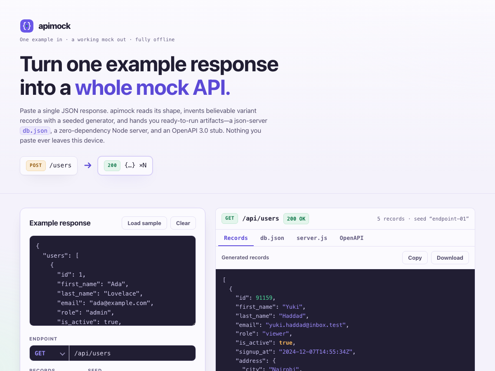

# apimock

**Build a working mock API from one example JSON response.** Paste a single response, and apimock infers the schema, invents realistic variant records with a seeded generator, and hands you ready-to-run artifacts — a json-server `db.json`, a dependency-free Node server, and an OpenAPI 3.0 stub. 100% client-side, zero dependencies, works fully offline.

## Why

You have one real response from an endpoint — a screenshot in a ticket, a `curl` you ran once, a sample in some docs. You need a mock that returns *many* records of that shape so you can build the frontend, seed a demo, or write a test. Doing it by hand means retyping the same fields with slightly different values, over and over, and hoping you kept the types straight.

apimock does it from the example. It reads the shape once — types, nested objects, arrays and their element shape — then generates as many believable variants as you ask for, using key-name heuristics so `email` looks like an email, `price` looks like money, and `created_at` looks like a timestamp. The generator is **seeded**, so the same seed and example produce byte-identical records every run: your teammate gets the exact same mock you do. Then it packages the result three ways so you can go from paste to running server in seconds.

## Features

- **Schema inference from one example** — types, nested objects, and arrays of objects with their element shape, shown as a readable tree with detected formats (uuid, email, uri, date-time).
- **Realistic seeded fake data** — key-name heuristics turn `id`, `email`, `name`/`first`/`last`, `*_at`/`date`, `price`/`amount`/`total`, `url`/`link`, `phone`, `city`/`country`, and `is*`/`has*` booleans into believable values. Values that already look like a UUID, email, URL, or ISO date are mimicked exactly.
- **Deterministic output** — a seeded PRNG (a cyrb53 hash feeding mulberry32) means the same seed reproduces identical records. Change the seed or press reroll for a fresh, equally reproducible set.
- **json-server `db.json`** — plus the exact `npx json-server` command to run it, with the endpoint route filled in.
- **Standalone Node server** — a `server.js` that uses only the built-in `http` module (no `npm install`), serving both the collection and single-item routes.
- **OpenAPI 3.0 stub** — a minimal, valid spec describing the shape, with the path, a component schema, and detected string formats.
- **Copy or download everything** — records, `db.json`, `server.js`, and the OpenAPI stub.
- **100% offline** — no accounts, no network calls, no tracking. Your example and everything generated from it stay in this browser.

## Quickstart

Just open `index.html` in any modern browser — no build step, no server, no install.

- **Local:** double-click `index.html`, or run a static server in the folder.
- **Hosted:** **[Open apimock live](https://sreenivas-sadhu-prabhakara.github.io/apimock/)**

Your last example, seed, count, and endpoint are saved in your browser's local storage, so they persist between visits on the same device.

## Privacy

- A strict Content-Security-Policy sets `connect-src 'none'`: the app **cannot** make any network request, even if it tried.
- No external fonts, scripts, images, or analytics. Everything is self-contained in a few files.
- All logic runs in your browser. Your example JSON and every record generated from it are never transmitted or stored anywhere but your own device.
- Because there are no network dependencies, it keeps working offline — download it once and it runs with no connection at all.

## Disclaimer

apimock is a developer convenience for **scaffolding mock data and test fixtures only**. The data it produces is **fake and randomly invented** — it is not real, not validated against any production contract, and the schema is inferred from a single example, so it may miss optional fields, union types, or edge cases; **review the inferred schema before you rely on it**. It is not a substitute for a real API, real test data, or professional advice. This software is provided under the MIT License, "as is", without warranty of any kind; the authors accept no liability for any loss or damage arising from its use.

## License

[MIT](./LICENSE) © 2026 Sreenivas Sadhu Prabhakara
